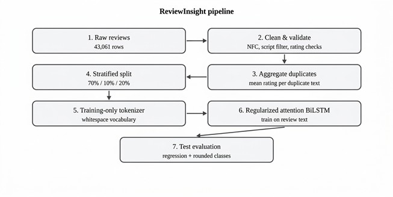
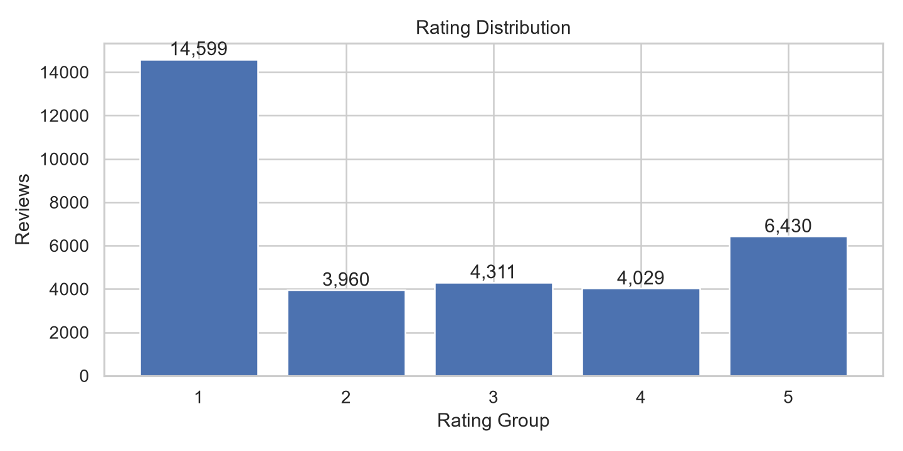
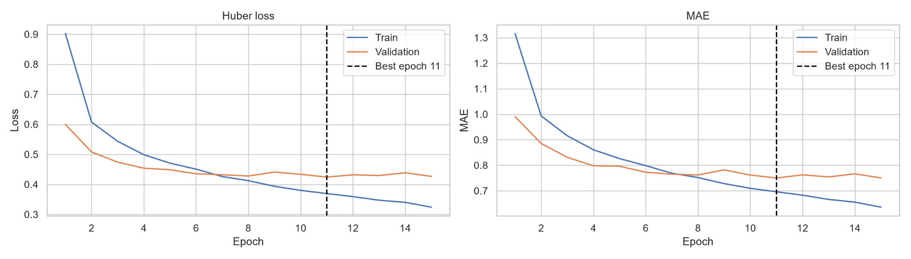
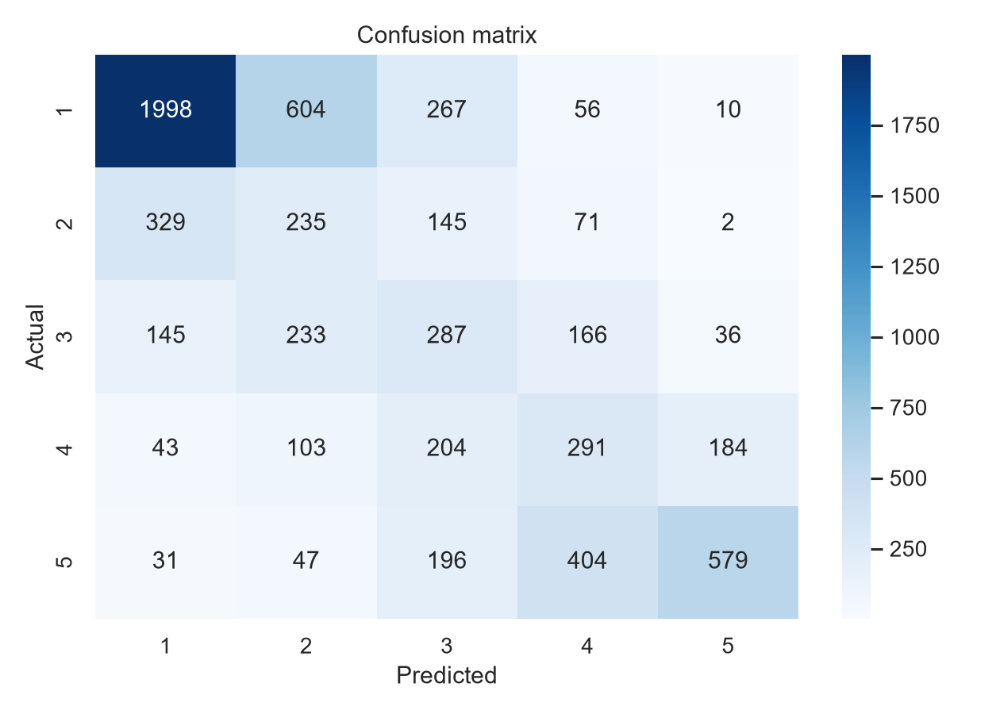
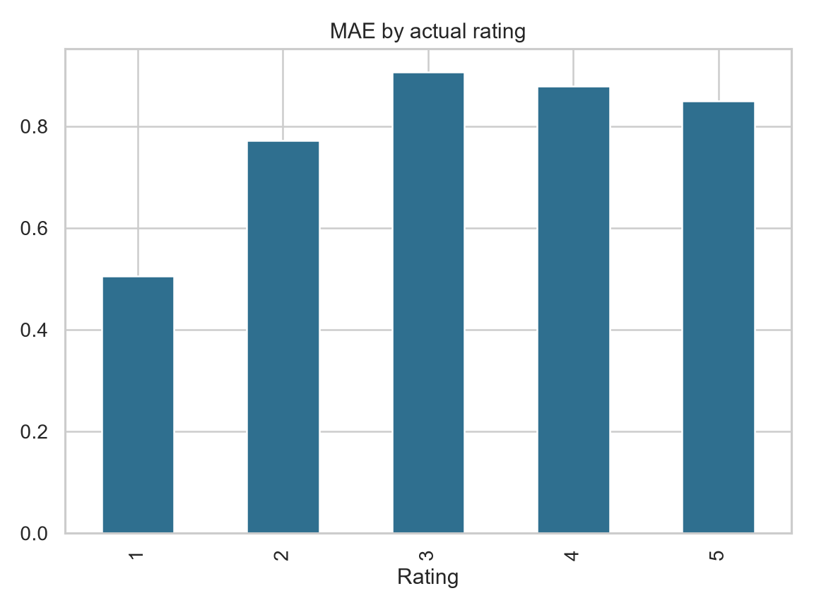
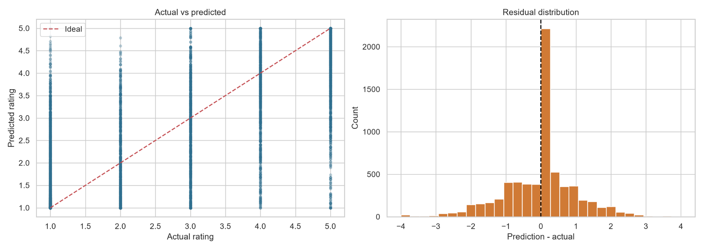

https://github.com/user-attachments/assets/50391a70-05ae-4b65-b436-8c1d8f18848f
# 🍽️ ReviewInsight

**ReviewInsight** is an NLP-based food review analysis project that predicts a **continuous rating from 1 to 5** from customer reviews using a **regularized BiLSTM regression model with attention**.

The current implementation focuses on **overall rating prediction**. The long-term goal is to extend the system to **multi-aspect analysis**, such as food quality, delivery service, service quality, and price/value.

---

## 🎥 Demo

https://github.com/user-attachments/assets/19fb679a-3547-4af4-8c60-ed52db97c599

---

## ✨ Main Features

- Cleans English and Bangla review text
- Handles invalid and duplicate reviews
- Merges repeated reviews using their **mean rating**
- Uses a **training-only vocabulary** to avoid data leakage
- Uses a **128-dimensional trainable PyTorch embedding**
- Uses a **Bidirectional LSTM**
- Combines:
  - Attention pooling
  - Average pooling
  - Max pooling
- Predicts a **continuous rating**
- Uses **Huber Loss** for regression
- Uses **AdamW** optimizer
- Uses **validation MAE** for model selection and early stopping
- Includes diagnostic plots and a Flask-based prediction interface

---

## 🧠 Model Pipeline



---

## 📊 Dataset

### Sources

- [Mendeley Data](https://data.mendeley.com/datasets/2p5cyjwmrx/1/files/d11fb3b1-a8c0-45db-acd3-32beb8bb1bfb)


Main fields used:

```text
review_text
ratings_int
```

### Preprocessing

The preprocessing stage:

1. Converts text to lowercase
2. Applies Unicode NFC normalization
3. Keeps English letters, Bangla characters, `!`, `?`, and spaces
4. Removes invalid ratings
5. Keeps ratings in the `1–5` range
6. Removes very short reviews
7. Detects repeated review text
8. Merges duplicate reviews using the **mean rating**
9. Creates `rating_stratify` only for balanced splitting
10. Calculates review word count

### Data Split

```text
Train       70%
Validation  10%
Test        20%
```

The split is stratified using rating groups so the rating distribution remains approximately balanced across all three sets.

The tokenizer is fitted **only on the training data**.

### Rating Distribution



---

## 🔤 Tokenization and Embedding

The tokenizer uses:

```text
MAX_VOCAB = 15,000
MAX_LEN   = 120
```

Special IDs:

```text
0 → Padding
1 → OOV / Unknown word
2+ → Vocabulary words
```

The model uses:

```python
nn.Embedding(vocab_size, 128, padding_idx=0)
```

This is a **trainable embedding**, not pretrained Word2Vec or GloVe.

The embedding vectors are learned together with the rest of the model through:

```text
Prediction
    ↓
Huber Loss
    ↓
Backpropagation
    ↓
AdamW
    ↓
Embedding + BiLSTM + Attention + FC weights update
```

---

## 🔁 BiLSTM + Attention

The BiLSTM configuration is:

```text
Embedding input size = 128
Forward hidden size  = 80
Backward hidden size = 80
Output per token     = 160
```

The BiLSTM processes each review in both directions, allowing each token representation to use both left and right context.

After the BiLSTM:

```text
Attention summary → 160
Average pooling   → 160
Max pooling       → 160
```

These are concatenated:

```text
160 + 160 + 160 = 480 features
```

The final regression head is:

```text
480 → 64 → 1
```

---

## ⚙️ Training

Training configuration:

```text
Loss Function : Huber Loss
Optimizer     : AdamW
Learning Rate : 3e-4
Weight Decay  : 1e-3
Batch Size    : 64
Max Epochs    : 30
```

Training flow:

```text
Forward Pass
    ↓
Prediction
    ↓
Huber Loss
    ↓
loss.backward()
    ↓
Gradient Clipping
    ↓
optimizer.step()
```

A `ReduceLROnPlateau` scheduler is used to reduce the learning rate when validation MAE stops improving.

Early stopping monitors validation MAE and restores the best saved model state.

### Training Curves



---

## 🧪 Evaluation

Since this is a **regression model**, the primary evaluation focuses on continuous prediction error:

- **MAE**
- **RMSE**
- **R² Score**

For additional analysis, predictions are rounded to the nearest star rating.

> The confusion matrix is only a diagnostic view of rounded regression predictions; the model itself is not a 5-class classifier.

### Confusion Matrix



### MAE by Actual Rating



### Prediction Diagnostics



---

## 🖥️ Inference

During inference:

```text
User Review
    ↓
Cleaning
    ↓
Input Validation
    ↓
Saved Tokenizer
    ↓
Saved Trained Model
    ↓
Predicted Rating
    ↓
Sentiment
```

Example:

```text
Input:
"The food was delicious and delivery was fast."

Output:
Predicted Rating: 4.6 / 5
Sentiment: Positive
```

No backpropagation or model update happens during inference.

---

## 🛠️ Tech Stack

- Python
- PyTorch
- Pandas
- NumPy
- Scikit-learn
- Flask
- Matplotlib
- Seaborn
- Jupyter Notebook

---

## 📁 Repository Structure

```text
ReviewInsight/
│
├── README.md
├── ReviewInsight.ipynb
├── reviewinsight_model.pt
│
└── assets/
    ├── demo.mp4
    ├── rating_distribution.png
    ├── training_curves.png
    ├── confusion_matrix.png
    ├── per_class_mae.png
    └── prediction_diagnostics.png
```

---

## 👥 Collaborators

<table>
  <tr>
    <td align="center">
      <a href="https://github.com/tusharkumarroy">
        
        <br/>
        <b>Tushar Kumar Roy</b>
      </a>
      <br/>
      <sub>2107037</sub>
    </td>
    <td align="center">
      <a href="https://github.com/Dipta-38">
        
        <br/>
        <b>Dipta Chowdhury</b>
      </a>
      <br/>
      <sub>2107038</sub>
    </td>
  </tr>
</table>

---

## 🔮 Future Work

- Multi-aspect detection
- Aspect-specific rating prediction
- Aspect-specific sentiment prediction
- Better handling of rating imbalance
- Transformer-based comparison
- Public deployment

---

## 📄 Note

This project was developed for academic and educational purposes.  
Please follow the license and usage conditions of the original datasets.
